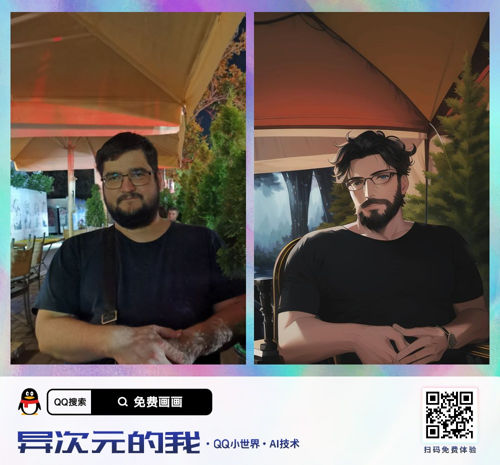

# What is this
A Telegram bot for making anime-styled pictures and videos from your source.

It's a simple bridge between Telegram and https://h5.tu.qq.com/web/ai-2d/cartoon/index

Demo: https://t.me/qq_neural_anime_bot

# Running your own bot
You need to have Node.js and NPM installed.

Create your bot with https://t.me/BotFather and obtain its token.

Clone this repo and:

- run `npm install`
- copy `config.example.ts` to `config.ts`
- put your bot's token from BotFather into `config.ts`
- run `npm start`

# Mode
The bot works in different modes, you can switch it in your `config.ts` to the one that suits you better.

It might produce single images, compared images and videos in different styles and quality.

All modes are unstable and their behavior may change at any time.

| Mode                      |  Style  | Single  | Compared | Video | Rate limits | Availability   |
| :---                      |  :---:  |  :---:  |  :---:   | :---: |    :---:    |     :---:      |
| AI_PAINTING_SPRING        | Spring  | Cropped | +        | Slow  | -           | Most countries |
| DIFFERENT_DIMENSION_ME    | Classic | Cropped | +        | -     | High        | Most countries |
| AI_PAINTING_ANIME         | Classic | Slow    | +        | Slow  | High        | China only     |
| AIGCSDK_AI_PAINTING_ANIME | Classic | Fast    | -        | -     | Low         | Most countries |

# Proxies
In some countries the AI doesn't work at all so if it is your case you have to use some proxy.

Seems like Chinese proxies are the best.
But not from Taiwan or Hong Kong, try Beijing for example.

It's almost impossible to find free alive proxies. Don't waste your time searching and just buy it somewhere.

# Notes
- Probably the whole thing is going to break soon anyway.
- Fork it and make your own version, because I don't think that I'm going to support it in the future.
- Contact me at Telegram: https://t.me/royvolkov

# Upgrading
Don't forget to always run `npm install`

When upgrading to a major release, you must modify your `config.ts` to match the new `config.example.ts`
